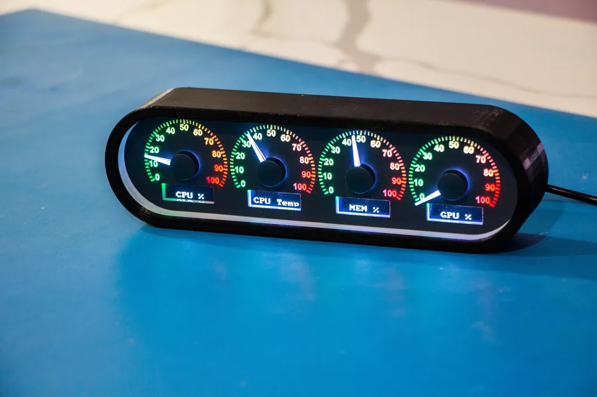
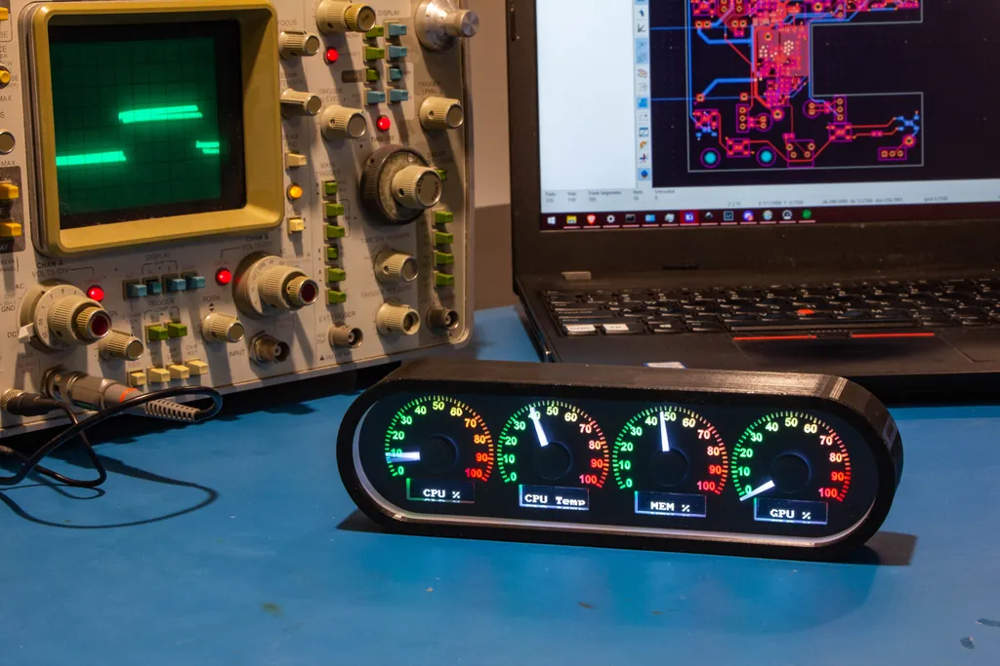
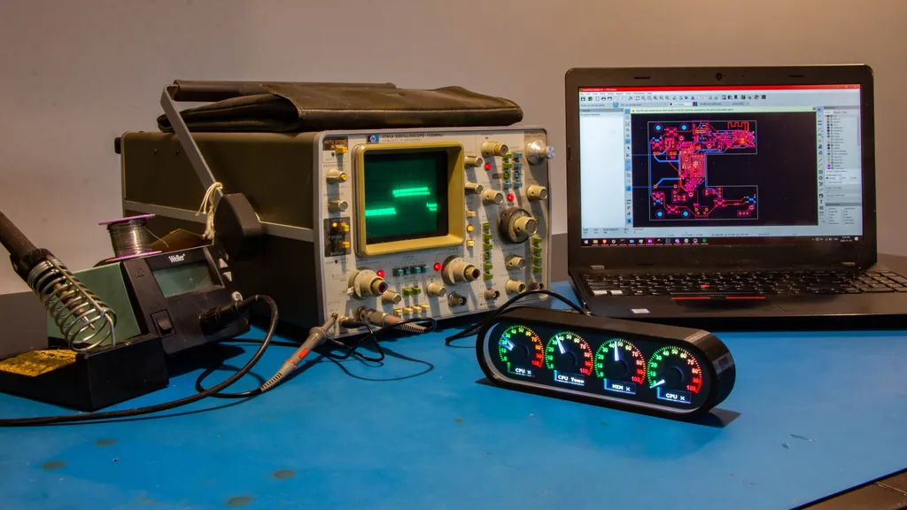
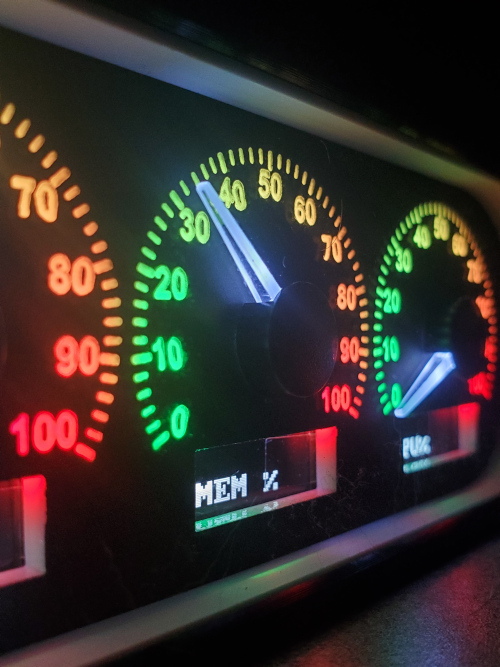

<section class="intro">
  

    
  

  

    <h1>Meet the PolyCluster</h1>
    

      This is a physical performance dashboard for your PC: a compact 4-gauge cluster with     real needle dials and tiny screens that you can label however you want. Each gauge     runs from 0 to 100, so you can map it to anything – CPU, GPU, RAM, temperature, fan    speed, network usage, and more.
    

    

      Powered by USB and talking to your computer over standard HID, it’s plug-and-play and      always in view, no alt-tabbing required. RGB backlighting lets it blend into your      setup or stand out on your desk, giving you a clean, at-a-glance view of how your      machine is really behaving while you game, create, or code.
    

  

</section>

<section class="carousel">
  <button class="ctrl prev" aria-label="Previous slide">&#10094;</button>
  

    <ul class="track">
      <li class="slide"></li>
      <li class="slide"></li>
      <li class="slide"></li>
      <li class="slide"></li>      
    </ul>
  

  <button class="ctrl next" aria-label="Next slide">&#10095;</button>
</section>